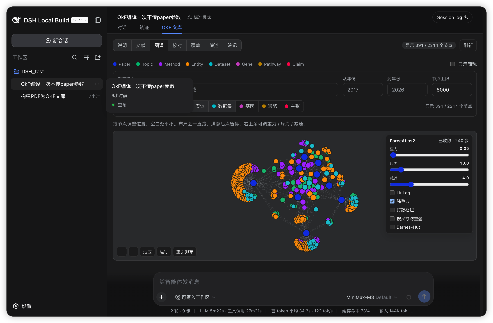

# dsh-okf

[中文](./README.md) | [English](./README.en.md)

DeepSeek Harness plugin: ingest research PDFs (and docx / other documents) into a local **citable OKF markdown library**, then search, graph, measure coverage, and write surveys in the same conversation.

> Models, API keys, and base URLs are **entirely Harness-controlled**. This plugin does not configure a model.



Core convention: **Claim is the citation atom, Paper is a linked digest, and Topic / Method / Entity / Dataset / Gene / Pathway are hub nodes.** The agent is expected to walk this typed graph instead of reading PDFs in full.

## Features

- **Document ingest** — `okf_ingest` accepts files or directories (recursive). PDFs use an anydoc text layer with a pdfjs fallback; true scans and figure pages are rasterized and read by the harness multimodal model. docx / pptx / xlsx / epub and similar formats convert straight to Markdown.
- **Full-extract compile** — the whole extract is map-reduced in ~12k-character segments (schema v3), so later pages are not dropped. Gene / Pathway extraction is opt-in.
- **Citable markdown library** — papers, topics, methods, entities, datasets, genes, pathways, claims, notes, questions, and surveys, all cross-linked under workspace `OKF/`.
- **Search** — `okf_search` (FTS with IDF/title weighting, optional vector fusion), `okf_evidence`, `okf_compare`, `okf_backlinks`, `okf_neighbors`, `okf_graph` multi-hop neighbors.
- **Coverage** — topic × year heatmap plus gaps across methods, datasets, genes, and pathways.
- **Review** — near-duplicate hubs in a two-column compare, AI merge suggestions, missing dates / DOI / biblio. The row disappears on click; the merge continues in the background.
- **Survey writing** — draft → `okf_cite_check` verifies every id → `okf_save_survey`; no hidden LLM calls.
- **Export and migrate** — BibTeX / Pandoc markdown / LaTeX via `okf_bib` / `okf_export`; portable packs via `okf_pack` / `okf_merge` (PDFs omitted).
- **Web UI** — search/coverage tool cards, an SVG mini-graph per chat turn, and an **OKF Library** tab (help / papers / graph / review / coverage / surveys / notes).

## Pipeline

```
source files
  → copy into sources/pdfs or sources/docs (same hash is skipped)
  → extract text (anydoc; a broken text layer is routed to vision)
  → vision (default auto: every page on scans; figures + thin-text pages on born-digital PDFs)
  → segmented compile (biblio → concepts → claims → digest)
  → hub align / near-duplicate merge
  → write papers/ topics/ methods/ … and refresh the index
```

- **ingest** defaults to 3 documents in parallel; compile is locked per library so jobs cannot clobber each other.
- Vision sends 2 pages per request, retries timeouts, and resumes remaining pages. `visionMaxPages` can pause auto mode on very long PDFs.
- `okf_compile` without `paper` skips extracts whose schema version and extract hash are unchanged. Passing `paper` (a papers id, extract path, or source filename) always recompiles that target.
- Unquoted claims are pruned automatically after compile; they are not a human review queue.

## Requirements

- A [DeepSeek Harness](https://github.com/deepseek-ai/dsh) installation with the `dsh` CLI
- Node.js ≥ 20 and pnpm
- A local checkout of this repository

## Installation

### 1. Build the plugin

```sh
cd dsh-okf
pnpm install   # runs `prepare`, which builds lib/
```

### 2. Add it to a Harness profile

```sh
dsh plugin --profile <name> add ./dsh-okf
```

To pin a public plugin repo by commit:

```sh
dsh plugin --profile <name> add github:1-CellBio/dsh-okf#<commit>
```

#### What is `--profile <name>`?

`--profile <name>` selects **which Harness profile** the plugin is installed into, and is **required** (there is no default).

A *profile* is a self-contained dsh environment living at `~/.dsh/profiles/<name>` (override with the `DSH_HOME` env var). Each profile has its own `package.json`, `node_modules/`, and `cordis.patch.yml`.

- `<name>` is any name you choose (a single path segment, no `/`). Common choices: `web` (for `dsh web`) or `headless`.
- If the profile does not exist yet, `dsh plugin --profile <name> add …` **creates it automatically** (`web`/`headless` get full templates; any other name starts with `@deepseek-ai/dsh-base`).
- Launch with the same name afterwards, e.g. `dsh web --profile web` (or just `dsh web`, which implies `--profile web`).

#### pnpm ≥10 note

pnpm ≥10 blocks git `prepare` scripts until you allow them. Copy the key `dsh` prints into the profile's `pnpm-workspace.yaml`:

```yaml
allowBuilds:
  dsh-okf: true
```

Then re-run `add` (keep the `#<commit>` pin).

Restart **`dsh web`** after changing `dsh.client`; the client scan caches a negative verdict until restart.

## Configuration

Pick a Harness **workspace folder**. The library lives in **`OKF/`** inside it. The browser does not read the folder; host tools read it on disk, and sandbox `fs` / bash see the same files because they share the session cwd.

On first use, send `初始化OKF` (or “initialize OKF”) in chat so the agent can create the folder layout.

Default layout inside the workspace:

| Path | Role |
|---|---|
| `OKF/papers/`, `OKF/topics/`, `OKF/methods/`, `OKF/entities/`, `OKF/datasets/`, `OKF/genes/`, `OKF/pathways/`, `OKF/claims/`, `OKF/notes/`, `OKF/questions/`, `OKF/surveys/`, `OKF/extracts/` | Concept markdown |
| `OKF/sources/pdfs/` | Original PDFs (local only; packs omit them) |
| `OKF/sources/docs/` | Non-PDF source files |
| `OKF/manuscripts/` | `okf_export` / `okf_pack` output (not a concept prefix; packs omit it) |
| `OKF/.okf/` | Rebuildable index and pipeline state (packs omit it) |

`${cwd}` / `${workspace}` is the **session workspace**, not the directory you launched `dsh` from. Inspect the resolved snapshot with `okf_paths`.

Move a library between workspaces with `okf_pack` then `okf_merge` (or the CLI). Do not copy `sources/pdfs/` into a pack.

Do **not** put a machine-specific absolute path in the plugin bundle or in a shared profile.

### Optional overrides

Leave these unset unless the library should live outside the workspace. dsh loads `<launch-cwd>/.env` then `~/.dsh/.env`. `${HOME}` in a `.env` file is not expanded:

```sh
OKF_DIR=/path/to/your/okf
OKF_PDF_DIR=/path/to/your/pdfs
OKF_EXPORT_DIR=/path/to/your/manuscripts
```

An id-targeted profile patch **replaces the whole `config`**, so restate every field you still need:

```yaml
- id: okf
  config:
    okfDir: ${cwd}/OKF
    pdfDir: ${okfDir}/sources/pdfs
    exportDir: ${okfDir}/manuscripts
```

Supported tokens: `${cwd}`, `${workspace}`, `${home}`, `${dshHome}`, `${okfDir}`, `${pdfDir}`, `${exportDir}`, `${env:NAME}`. Unknown `${var}` fails loud.

Resolution order per directory: a non-default config value → matching `OKF_*` env var → schema default (`${cwd}/OKF`, `${okfDir}/sources/pdfs`, `${okfDir}/manuscripts`).

Relative `okf_ingest` paths resolve against `pdfDir`. Relative `okf_export` / `okf_pack` paths resolve against `exportDir`. `okf_merge` `from` is relative to the workspace.

### Live settings (Host and Web)

The plugin registers an `okf` settings namespace (`installSettingsSection`). After boot, `okf_paths` shows the resolved folders. `okf_set_paths` (and the Settings → Plugins card) are **optional overrides** — later tool calls pick them up without restart.

Empty text (or **Reset**) clears the user layer so the field re-inherits the composition default.

Misconfiguration fails loud. There is no silent fallback.

## Tools

| Tool | Role |
|---|---|
| `okf_help` | Usage guide + copy-paste example prompts |
| `okf_paths` / `okf_set_paths` | Show resolved workspace paths; optional override |
| `okf_ingest` | Background job: copy sources, extract, vision, segmented compile |
| `okf_compile` | Background job: compile existing `extracts/*.md` (incremental; `paper` forces a rerun) |
| `okf_search` / `okf_get` | Full-text search (optional semantic fusion); fetch one page (1–2 per turn) |
| `okf_coverage` / `okf_stats` | Coverage matrix + gaps; library census |
| `okf_check` | Health audit: dead links, isolated nodes, unrecorded PDFs, incomplete pipeline |
| `okf_graph` / `okf_neighbors` / `okf_backlinks` | Graph query; one-hop neighbors; reverse references |
| `okf_evidence` / `okf_compare` | Claim evidence; bounded paper comparison (do not compare an unscoped 1000-paper library) |
| `okf_canonicalize` | Merge a duplicate hub into the canonical page; rewrite links; leave a redirect |
| `okf_save_note` | Write `notes/*.md` with Paper/Claim links |
| `okf_cite_check` / `okf_save_survey` | Draft → verify ids → write `surveys/*.md` (no hidden LLM) |
| `okf_compile_survey` | Optional background job that drafts a survey with the harness default model |
| `okf_sync_vectors` | Build/refresh the semantic vector index (requires `KG_EMBED_MODEL`) |
| `okf_bib` / `okf_export` | BibTeX / Pandoc markdown / LaTeX under `manuscripts/` |
| `okf_pack` / `okf_merge` | Portable pack (no PDFs) and merge into this workspace |

Long work uses `ctx.jobs` (`run_in_background` defaults true). Read `job_output`; do not treat job-internal completions as this chat's assistant messages.

`okf_ingest` rasterizes figure/scan pages with `@napi-rs/canvas` and sends JPEGs through `ctx.llm` (the harness default multimodal model) plus `ctx.attachments`. `vision="skip"` / `skipVision: true` only skips optional figures on born-digital PDFs; true scans still run vision.

Semantic retrieval is **opt-in**: set `KG_EMBED_MODEL` / `KG_EMBED_BASE_URL` / `KG_EMBED_API_KEY`, run `okf_sync_vectors`, and `okf_search` / `okf_evidence` / `okf_graph` fuse vector hits with full-text hits (so synonyms like "breast cancer" match "BRCA").

## Web UI

The plugin ships a browser half (`exports["./client"]`, i.e. `dsh.client`). The composed Loader row is scanned into `window.__DSH_BOOT__`; no extra patch row is required beyond the existing `okf` host insert.

Shipped now:

- `okf_search` toolview — hit list (type, title, year/id)
- `okf_coverage` toolview — topic × year heatmap plus a collapsible gap list
- Settings → Plugins card — staged `okfDir` / `pdfDir` / `exportDir` (card `id: okf`, `order: 30`)
- Conversation Node `okf-graph` — one SVG graph per turn that used `okf_search` / `okf_get` / `okf_coverage` / `okf_graph`
- Conversation view tab **OKF Library** (beside Conversation / Trace)

The browser never reads the OKF folder. Snapshots come from `/okf/library`, `/okf/organize`, `/okf/coverage`, `/okf/page`. Writes stay in chat tools (`okf_save_note`, `okf_save_survey`, `okf_canonicalize`, …).

### Graph page

Chat-card mini graphs are SVG with a type-column layout. The library overview uses WebGL (**sigma.js + graphology**, the same ForceAtlas2 stack as Gephi):

- Default node cap **8000** (sized for a 1000-paper overview); `0` uses the server hard cap of **20,000**. Claims are off by default.
- **Run / Pause / Relayout**, with a live frame refresh while the layout runs. Gravity, scaling, slowdown, LinLog, strong gravity, hub dissuasion, overlap prevention, and Barnes-Hut are on the panel.
- Dragging a node pins it; the rest of the graph keeps moving. Pan on empty space; scroll to zoom.
- Layout runs in a Web Worker; if the worker cannot start, a main-thread per-frame fallback keeps the UI live.

### Review page

Needs-action only lists near-duplicate hubs, missing publication dates, low-confidence biblio, and merge conflicts. Compiled claims are already usable for search and surveys; they are not proofread here one by one.

Open a near-duplicate to compare both pages under that row: keep left, keep right, or keep both. An AI suggestion is shown. The row leaves the list immediately; link rewriting continues in the background.

## Development

This repository is the full plugin: `src/lib/` holds extract, compile, index, retrieve, graph, and survey logic; files at `src/` are the Cordis / dsh adapter (`tools.ts`, `jobs.ts`, `library-http.ts`). tsdown builds `lib/index.js` for Node and bundles sigma / graphology into `lib/client.js` (React is a platform module).

```sh
cd dsh-okf
pnpm install
pnpm run build
```

Restart `dsh web` and hard-refresh after client changes, or the host will keep serving a cached bundle.
